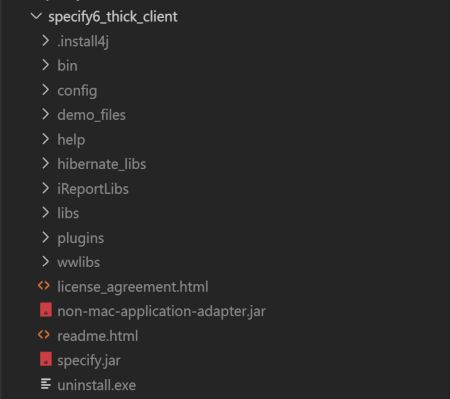

# Specify 7 in Docker

Dockerized version of [Specify 7](https://github.com/specify/specify7). The included 
[Docker image](https://github.com/rbgvictoria/specify7-docker/blob/master/specify7/Dockerfile) 
is for version 7.3.1 of the software.

Specify 7 is build upon Specify 6, so you need a running instance of Specify 6.

- [Installation](#Installation)
- [Upgrade from Specify 7.3.1 to Specify 7.4.0](#upgrade-from-specify-731-to-specify-740)

## Installation

- Clone this repository.
  ```
    git clone https://github.com/rbgvictoria/specify7-docker.git
  ```

- Copy your Specify 6 client into the `specify7/specify6_thick_client` directory. 
Make sure your dircetory structure looks like in the image below and that there 
is no `specify6` (or something like that) subfolder between the 
`specify6_thick_client` folder and the `specify.jar` file and the `config` 
subfolder.

  .

- Rename `example.local_specify_settings.py` in `specify7/specify7_config` to 
  `local_specify_settings.py`

- Add your database connection details in `local_specify_settings.py`. If you 
  want to connect to a local instance of MySQL, use `host.docker.internal` (that 
  works for me on Windows; if it doesn't work on your system, check your 
  `etc/hosts` file), not `localhost`, as `DATABASE_HOST`.

- Build the Docker image and start the container
  ```
    cd specify7-docker
    docker-compose up -d
  ```
  Your Specify 7 instance should now be available at `http://localhost:<port>`. 
  I use port number 65001, because I have another webserver instance running on 
  port 80, but you can change the port in the `docker-compose.yml` file.

- To stop the container:
  ```
    docker-compose stop
  ```
- To destroy the container:
  ```
    docker-compose down
  ```
- To rebuild the container (for example for a new release of Specify 6):
  ```
    docker-compose up -d --build
  ``` 

  ## Upgrade from Specify 7.3.1 to Specify 7.4.0

  In order to run Specify 7.4.0, you have to replace the Specify 6 client 
  (`specify6_thick_client`) with Specify 6.8.00 and make sure the database you
  want to connect to has been upgraded to the new version.

  Then:

  - Pull the changes from the GitHub repository:

  ```
    git pull origin master
  ```

  - Destroy the container:

  ```
    docker-compose down
  ```

  - Rebuild the container:

  ```
    docker-compose up -d --build


